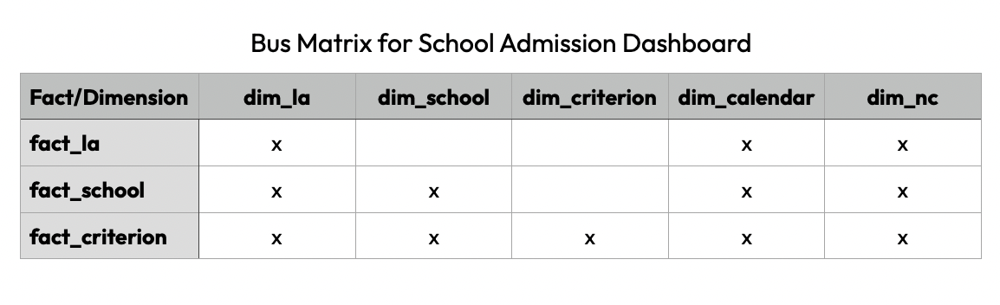

```{r setup, include=FALSE}
# Load knitr package
library(knitr)

# Knitr Options
opts_chunk$set(
	echo = TRUE,
	message = FALSE,
	warning = FALSE,
	fig.align = 'center'
)
```

# Introduction
This notebook serves as the documented code to read and prepare data for the School Admissions Dashboard project ([github](https://github.com/clarelgibson/schools) | [tableau](https://public.tableau.com/views/Schools_16505251102060/Home?:language=en-GB&:display_count=n&:origin=viz_share_link)).

I begin by reading in the raw data required for the dashboards. I then explain my intended approach to convert the raw data into a "star-schema" dimensional model, using conformed dimensions to serve multiple fact tables. Finally I work through the data wrangling steps necessary to prepare the dimensional model.

## Data sources
The full list of data sources, methodologies for retrieval and metadata descriptions can be found in the [README](https://github.com/clarelgibson/schools/blob/main/README.md) file for this project.

## Packages
I will make use of the following packages for this analysis:

* `tidyverse`
* `data.table`
* `janitor`
* `lubridate`

```{r packages}
library(tidyverse)    # for general wrangling
library(data.table)   # for transposing dataframes
library(janitor)      # for cleaning column headers
library(lubridate)    # for converting strings to dates
```

# Read data
## Offers by local authority
This dataset includes details of the number of offers made by preference within each local authority (LA) in England for the academic year 2014/15 through to 2021/2022. The data is aggregated by LA.

```{r read-offers-la}
# Read in the offers by LA data
# Step 1: create a list of files to read in
offers_la_files <- 
  list.files(
    path = "data-in/offers-la",
    pattern = "*.csv",
    full.names = TRUE
  )

# Step 2: read all files into a list of df.
offers_la_list <- 
  setNames(
    lapply(
      offers_la_files,
      read_csv
    ),
    offers_la_files
  )

# Step 3: create a single df by binding rows from each df in the list
# above
r_offers_la <- offers_la_list %>% 
  bind_rows(.id = "filename") %>% 
  clean_names()
```

After reading in each source data file, I extract the column headings into a new dataframe and store them along with the source table name. Having a table containing all of the field names contained in the raw data will help me when it comes to remapping the fields into the dimensional model.

Since I will need to do this for every table that I read in, I will define a function that can be re-used.
```{r transpose-function}
# Define a function to use for the transpose tasks
describe_df <- function(df) {
  # This function takes a df as input and returns a new df
  # containing the original df name, original df column names
  # and an example of one of the values stored within each column
  df_name <- deparse(substitute(df))
  t_df <- 
    transpose(head(df, 1))
  rownames(t_df) <- colnames(df)
  t_df <- 
    t_df %>% 
    rownames_to_column() %>% 
  mutate(source_table = df_name) %>% 
  rename(source_field = rowname,
         source_value_example = V1) %>% 
  select(source_table,
         source_field,
         source_value_example)
  return(t_df)
}
```

With the function defined, I can now apply this to the `r_offers_la` dataframe.
```{r transpose-offers-la}
# Extract the column names into a new table
t_offers_la <- 
  describe_df(r_offers_la)
```

## Offers by school
This dataset includes admissions data for each school within Waverley Borough in Surrey for the academic year 2018/2019 through to 2021/2022. The data is aggregated by school.

```{r read-offers-school}
# Read in the offers by school data
# Step 1: create a list of files to read in
offers_sch_files <- 
  list.files(
    path = "data-in/offers-school",
    pattern = "*.csv",
    full.names = TRUE
  )

# Step 2: read all files into a list of df. Explicitly stating the 
# data type for each column to avoid binding issues later.
offers_sch_list <- 
  setNames(
    lapply(
      offers_sch_files,
      read_csv,
      col_types = "ncnncnnnn"
    ),
    offers_sch_files
  )

# Step 3: create a single df by binding rows from each df in the 
# list above
r_offers_sch <- offers_sch_list %>% 
  bind_rows(.id = "filename") %>% 
  clean_names()
```

Apply the `describe_df()` function.
```{r transpose-offers-school}
# Extract the column names
t_offers_sch <- describe_df(r_offers_sch)
```

## Offers by criteria
This dataset includes admissions data for each school within Waverley Borough in Surrey for the academic year 2018/2019 through to 2021/2022. The data is aggregated by school and by admission criterion.

```{r read-offers-crit}
# Read in the offers by criteria data
# Step 1: create a list of files to read in
offers_crit_files <- 
  list.files(
    path = "data-in/offers-criteria",
    pattern = "*.csv",
    full.names = TRUE
  )

# Step 2: read all files into a list of df. Explicitly stating the 
# data type for each column to avoid binding issues later.
offers_crit_list <- 
  setNames(
    lapply(
      offers_crit_files,
      read_csv,
      col_types = "ncnnccccnn"
    ),
    offers_crit_files
  )

# Step 3: create a single df by binding rows from each df in the list
# above
r_offers_crit <- offers_crit_list %>% 
  bind_rows(.id = "filename") %>% 
  clean_names()
```

Apply the `describe_df()` function.
```{r transpose-offers-crit}
# Extract the column names
t_offers_crit <- describe_df(r_offers_crit)
```

## School information
This dataset includes characteristics of each primary and secondary school in England. The data is aggregated by school.

```{r read-info}
# Read in the info data
# Step 1: create a list of files to read in
info_files <- 
  list.files(
    path = "data-in/info",
    pattern = "*.csv",
    full.names = TRUE
  )

# Step 2: read all files into a list of df.
info_list <- 
  setNames(
    lapply(
      info_files,
      read_csv
    ),
    info_files
  )

# Step 3: create a single df by binding rows from each df in the list
# above
r_info <- info_list %>% 
  bind_rows(.id = "filename") %>% 
  clean_names()
```

Apply the `describe_df()` function.
```{r transpose-info}
# Extract the column names
t_info <- describe_df(r_info)
```

## Key Stage 2 performance
This dataset includes details of primary school performance at Key Stage 2 (KS2). Also includes some school characteristics. The data is aggregated by school. KS2 is a phase of primary education for pupils aged 7 to 11 in England and Wales. A school's KS2 results therefore provide a measure of overall academic achievement.

```{r read-ks2}
# Read in Key Stage 2 data
# Step 1: create a list of files to read in
ks2_files <- 
  list.files(
    path = "data-in/ks2",
    pattern = "*.csv",
    full.names = TRUE
  )

# Step 2: read all files into a list of df. Reading all cols as
# character to avoid binding issues later
ks2_list <- 
  setNames(
    lapply(
      ks2_files,
      read_csv,
      col_types = cols(.default = "c")
    ),
    ks2_files
  )

# Step 3: create a single df by binding rows from each df in the list
# above
r_ks2 <- ks2_list %>% 
  bind_rows(.id = "filename")
```

Apply the `describe_df()` function.
```{r transpose-ks2}
# Extract the column names
t_ks2 <- describe_df(r_ks2)
```

## National curriculum years
This dataset includes details about the year groups that schools are divided into in the UK. The data is aggregated by year group.

```{r read-nc}
# Read in national curriculum data
# Step 1: create a list of files to read in
nc_files <- 
  list.files(
    path = "data-in/nc",
    pattern = "*.csv",
    full.names = TRUE
  )

# Step 2: read all files into a list of df.
nc_list <- 
  setNames(
    lapply(
      nc_files,
      read_csv
    ),
    nc_files
  )

# Step 3: create a single df by binding rows from each df in the list
# above
r_nc <- nc_list %>% 
  bind_rows(.id = "filename")
```

Apply the `describe_df()` function.
```{r transpose-nc}
# Extract the column names
t_nc <- describe_df(r_nc)
```

## Calendar
This dataset includes details about the academic years covered by the data.

```{r read-calendar}
# Read in calendar data
# Step 1: create a list of files to read in
calendar_files <- 
  list.files(
    path = "data-in/calendar",
    pattern = "*.csv",
    full.names = TRUE
  )

# Step 2: read all files into a list of df.
calendar_list <- 
  setNames(
    lapply(
      calendar_files,
      read_csv
    ),
    calendar_files
  )

# Step 3: create a single df by binding rows from each df in the list
# above
r_calendar <- calendar_list %>% 
  bind_rows(.id = "filename")
```

Apply the `describe_df()` function.
```{r transpose-year}
# Extract the column names
t_calendar <- describe_df(r_calendar)
```

# Model data
The matrix below shows the fact and dimension tables that I intend to create for this model and the relationships between them.


There are five dimension (lookup) tables and three fact (data) tables. The fact tables have the following grains:

* **Local Authority Facts (`fact_la`)**: one row represents one intake type (Reception, Year 3 or Year 7) for one local authority for one academic year.
* **School Facts (`fact_school`)**: one row represents one school for one academic year.
* **Criterion Facts (`fact_criterion`)**: one row represents one admissions criterion for one school for one academic year.

We can now bind together all of the tables we created with the field names from each piece of source data. This will provide a framework for remapping field names into the dimensional model structure.
```{r bind-transposed-tables}
# Bind the rows from each `t_` table
source_schema <- bind_rows(
  t_offers_la,
  t_offers_sch,
  t_offers_crit,
  t_info,
  t_ks2,
  t_nc,
  t_calendar
)
```

After exporting the new `source_schema` dataframe to Numbers, I created a file named [star-schema.csv](ref/star-schema.csv) which maps the raw source data to the corresponding dimension and fact tables for the star schema model.
```{r read-star-schema-planning}
# Read in star schema planning document
star_schema <- 
  read_csv("ref/star-schema.csv") %>% 
  clean_names()
```

## Bridge
<span style="color:red">Describe the purpose of the bridge table for schools.</span>
```{r bridge-school-predecessors}
# Build the table of predecessors
brg_school_pred <-
  # start with the info df
  r_info %>% 
  # keep only the open schools
  filter(
    grepl(
      "Open",
      establishment_status_name
    )
  ) %>% 
  # select the identifiers and linked establishments
  select(
    status = establishment_status_name,
    urn_1 = urn,
    starts_with("links_")
  ) %>% 
  # pivot the links
  pivot_longer(
    cols = starts_with("links_"),
    names_to = "link_number",
    values_to = "full_link_text",
    values_drop_na = TRUE
  ) %>% 
  # split the description column into useful data
  mutate(
    urn_2 = as.numeric(
      str_extract(
        full_link_text,
        "\\d+"
      )
    ),
    urn_2_type = str_trim(
      str_extract(
        full_link_text,
        "\\D+"
      )
    )
  ) %>%
  # keep only the successor records and remove the link type
  filter(
    grepl("Predecessor", urn_2_type)
  ) %>% 
  # remove redundant columns
  select(
    urn_1,
    urn_2,
    urn_2_type
  ) %>% 
  select(-urn_2_type) %>% 
  # join back the dfe_numbers from r_info
  left_join(
    select(
      r_info,
      urn_1 = urn,
      la_code,
      establishment_number
    )
  ) %>% 
  unite(
    col = dfe_1,
    la_code,
    establishment_number,
    sep = "/"
  ) %>% 
  left_join(
    select(
      r_info,
      urn_2 = urn,
      la_code,
      establishment_number
    )
  ) %>% 
  unite(
    col = dfe_2,
    la_code,
    establishment_number,
    sep = "/"
  )
```

```{r bridge-school-none}
# Find the non-linked urns and dfe numbers in r_info
brg_school_none <- 
  # start with the info df
  r_info %>% 
  # keep only the open schools
  filter(
    grepl(
      "Open",
      establishment_status_name
    )
  ) %>% 
  # select required columns
  select(
    urn_1 = urn,
    la_code,
    establishment_number
  ) %>% 
  # create the dfe number
  unite(
    col = dfe_1,
    la_code,
    establishment_number,
    sep = "/"
  ) %>% 
  # add urn_2 and dfe_2
  mutate(
    urn_2 = urn_1,
    dfe_2 = dfe_1
  )
```

```{r bridge-school}
# Bind the two tables together
brg_school <- 
  brg_school_none %>% 
  bind_rows(brg_school_pred) %>% 
  # arrange by urn_1
  arrange(urn_1) %>% 
  # count occurrences of urn_2 values
  group_by(urn_2) %>% 
  mutate(urn_2_count = n()) %>% 
  ungroup() %>% 
  # remove redundant self-joins
  filter(
    urn_2_count == 1 |
    (urn_2_count > 1 & urn_2 != urn_1)
  ) %>% 
  # count again occurrences of urn_2 values
  group_by(urn_2) %>% 
  mutate(urn_2_count = n()) %>% 
  ungroup() %>% 
  # remove groups with more than 1 member
  filter(urn_2_count == 1) %>% 
  # remove the count column
  select(-urn_2_count) %>% 
  # add the school key
  group_by(urn_1) %>% 
  mutate(school_key = cur_group_id()) %>% 
  ungroup() %>% 
  select(school_key, everything())
```

## Dimensions
### Criterion
The following data is required for the criterion dimension table:
```{r cols-dim-criterion}
# Which columns are needed for the criterion dimension?
star_schema %>% 
  filter(model_table == "dim_criterion") %>% 
  kable(caption = "Columns required for the criterion dimension")
```

All of these columns come from the `r_offers_crit` dataframe. I will first check the cleanliness of the data by ensuring that spelling variations are avoided for categorical data.

```{r uniques-criterion}
# View the unique values of criterion
r_offers_crit %>% 
  group_by(criterion) %>% 
  summarise(n = n()) %>% 
  kable(caption = "Unique values of the `criterion` column")
```

Looks ok.

```{r uniques-criterion-category}
# View the unique values of criterion
r_offers_crit %>% 
  group_by(criterion_category) %>% 
  summarise(n = n()) %>% 
  kable(caption = "Unique values of the `criterion_category` column")
```

The columns all look ok. To build the dimension table, I can pull out the required columns from `r_offers_crit` and reduce to show only the unique values. I also want to add a new column called `enhanced_criterion_flag` which will determine whether the criterion is classed as enhanced or not. An enhanced criterion is any prioritised attribute other than distance from the school. Finally, I will need to add a unique identifier for each row to be used as the primary key.
```{r build-dim-criterion}
# Build out the criterion dimension table.
dim_criterion <- r_offers_crit %>% 
  # select only the required columns
  select(criterion,
         criterion_category,
         criterion_description) %>% 
  # remove duplicate values
  distinct() %>% 
  # add enhanced criterion flag
  mutate(enhanced_criterion_flag =
           if_else(criterion_category %in% c("Central & Lates",
                                             "Distance"),
                   "Not Enhanced",
                   "Enhanced")) %>% 
  # sort rows
  arrange(criterion_category,
          criterion,
          criterion_description) %>% 
  # add primary key
  mutate(criterion_key = row_number()) %>% 
  # sort columns
  select(criterion_key,
         criterion,
         criterion_category,
         enhanced_criterion_flag,
         criterion_description,
         everything())

# View the head of the new dimension table
dim_criterion %>% 
  head() %>% 
  kable(caption = "Head of the criterion dimension table")
```

### Local authority
The following columns are required for the local authority dimension table:
```{r cols-dim-la}
# Which columns are needed for the local authority dimension?
star_schema %>% 
  filter(model_table == "dim_la") %>% 
  kable(caption = "Columns required for the local authority dimension")
```

All of these columns we need come from the `r_offers_la` dataframe. I will first check the cleanliness of the data by ensuring that spelling variations are avoided for categorical data.
```{r uniques-country-name}
# View the unique values of country
r_offers_la %>% 
  group_by(country_code,
           country_name) %>% 
  summarise(n = n()) %>% 
  kable(caption = "Unique values of the `country_code` and `country_name` columns")
```

```{r uniques-region-name}
# View the unique values of region
r_offers_la %>% 
  group_by(region_code,
           region_name) %>% 
  summarise(n = n()) %>% 
  kable(caption = "Unique values of the `region_code` and `region_name` columns")
```

To build the dimension table, I can pull out the required columns from `r_offers_la` and reduce to show only the unique values. Finally, I will need to add a unique identifier for each row to be used as the primary key.

```{r build-dim-la}
# Build out the local authority dimension table.
dim_la <- r_offers_la %>% 
  # select/rename only the required columns
  select(country_code,
         country = country_name,
         region_code,
         region = region_name,
         old_la_code,
         new_la_code,
         local_authority = la_name) %>% 
  # remove duplicate values
  distinct() %>%
  # sort rows
  arrange(country_code,
          region_code,
          new_la_code) %>% 
  # add primary key
  mutate(la_key = row_number()) %>% 
  # sort columns
  select(la_key,
         everything())

# View the head of the new dimension table
dim_la %>% 
  head() %>% 
  kable(caption = "Head of the local authority dimension table")
```

### School
The following columns are required for the school dimension table:
```{r cols-dim-school}
# Which columns are needed for the school dimension?
star_schema %>% 
  filter(model_table == "dim_school") %>% 
  kable(caption = "Columns required for the school dimension")
```

The columns we need for this dimension come from the `r_info` dataframe. I also have comments to convert the `easting` and `northing` values (which are UK-specific grid references) into latitude and longitude values. I have another comment to pivot the `linked_establishment` values so that we can build the bridging table for current and historical school records.

I can first check the cleanliness of the data by ensuring that spelling variations are avoided for categorical data.

```{r uniques-school-type}
# View the unique values of school type
r_info %>% 
  group_by(establishment_type_group_name) %>% 
  summarise(n = n()) %>% 
  kable(caption = "Unique values of the `establishment_type_group_name` column")
```

These values look ok, but I would like to reduce the string size to better fit in the visuals.

```{r uniques-school-religion}
# View the unique values of religious character
r_info %>% 
  group_by(religious_character_name) %>% 
  summarise(n = n()) %>% 
  kable(caption = "Unique values of the `religious_character_name` column")
```

These values look ok. Now I can build the dimension table.

```{r build-dim-school}
dim_school <- 
  # start with the info df
  r_info %>% 
  # filter to keep only urns in the urn_1 column of the bridge table
  filter(
    urn %in% brg_school$urn_1
  ) %>% 
  # add the school key
  left_join(
    select(
      brg_school,
      urn = urn_1,
      school_key
    )
  ) %>%
  distinct() %>% 
  # create the dfe_number
  unite(
    dfe_number,
    la_code,
    establishment_number,
    sep = "/"
  ) %>% 
  # select/rename the required columns
  select(school_key,
         urn,
         dfe_number,
         school_name = establishment_name,
         establishment_type = type_of_establishment_name,
         funding_type = establishment_type_group_name,
         school_status = establishment_status_name,
         open_date,
         close_date,
         phase_type = phase_of_education_name,
         religious_character = religious_character_name,
         statutory_low_age,
         statutory_high_age,
         administrative_district = district_administrative_name,
         administrative_ward = administrative_ward_name,
         street,
         locality,
         address3,
         town,
         county = county_name,
         postcode,
         easting,
         northing,
         school_website,
         telephone_num,
         head_title = head_title_name,
         head_first_name,
         head_last_name,
         head_preferred_job_title) %>% 
  # recode funding type
  mutate(funding_type = case_when(
    grepl("maintained", funding_type) ~ "Local authority",
    grepl("Free", funding_type) ~ "Free school",
    grepl("Acad", funding_type) ~ "Academy",
    TRUE ~ funding_type
  )) %>% 
  # convert dates to date type
  mutate(
    open_date = dmy(open_date),
    close_date = dmy(close_date)
  )

# View the head of the new dimension table
dim_school %>% 
  select(1:5) %>% 
  head() %>% 
  kable(caption = "Head of the school dimension table (columns truncated)")
```

#### Cuddington Croft Primary School
Cuddington Croft Primary School shows in the school information dataset as being situated in the administrative district of Sutton, which is a London Borough. However, for school admission purposes, this school falls under the remit of Epsom & Ewell in Surrey. I will make this correction in the schools dimension table to allow for more accurate reporting of Surrey data.
```{r dim-school-correction}
# Make corrections to the raw data in the school dimension
dim_school <- 
  dim_school %>% 
  # correct the district name for Cuddington Croft Primary
  mutate(administrative_district = if_else(
    grepl("Cuddington Croft", school_name),
    "Epsom and Ewell",
    administrative_district
  ))
```

### National curriculum year
This dimension contains columns relating to the national curriculum years associated with school, and can be used to allow us to distinguish between primary and secondary facts at the local authority level. For this one, we need to include everything in the `r_nc` dataframe with the exception of the filename.

```{r build-dim-nc}
# Build out the nc dimension table
dim_nc <- r_nc %>% 
  # remove the filename column
  select(-filename) %>% 
  # convert nc_key to integer type
  mutate(nc_key = 
           as.integer(nc_key))

# View the head of the new dimension table
dim_nc %>% 
  select(1:5) %>% 
  head() %>% 
  kable(caption = "Head of the national curriculum year dimension table")
```

### Calendar
This dimension will function as our date table. The dates in this case are all at the year level. We can use this dimension to structure the academic year identifiers in different ways and to segment the years by major events (e.g. the COVID-19 pandemic). For this one, we need to include everything in the `r_year` dataframe with the exception of the filename.

```{r build-dim-calendar}
# Build out the calendar dimension table
dim_calendar <- r_calendar %>% 
  # remove the filename column
  select(-filename) %>% 
  # convert year key to integer
  mutate(year_key = as.integer(year_key))

# View the head of the new dimension table
dim_calendar %>% 
  select(1:5) %>% 
  head() %>% 
  kable(caption = "Head of the calendar dimension table")
```

## Facts
### Local authority
The following columns are required for the local authority fact table:
```{r cols-fact-la}
# Which columns are required for the LA fact table?
star_schema %>% 
  filter(model_table == "Local Authority Facts") %>% 
  kable(caption = "Columns required for the local authority fact")
```

All of these columns come from the `r_offers_la` dataframe. In addition we need the following keys to join this fact table to our dimensions:

* LA Key
* Year Key
* NC Key

We will further need to filter the `r_offers_la` dataframe to include only rows that are aggregated at the local authority level.

```{r build-fact-la}
# Build out the local authority fact table
fact_la <- r_offers_la %>% 
  # filter to local authority level only
  filter(geographic_level == "Local authority") %>% 
  # join the LA Key
  left_join(select(dim_la,
                   la_key,
                   old_la_code)) %>% 
  # create year key on the fact side
  mutate(year_key = as.integer(str_sub(time_period,1,4))) %>% 
  # join the nc year key
  rename(nc_year = nc_year_admission) %>% 
  left_join(select(dim_nc,
                   nc_key,
                   nc_year)) %>% 
  # select/rename the columns required
  select(la_key,
         year_key,
         nc_key,
         admission_numbers,
         applications_received,
         online_applications,
         no_of_preferences,
         first_preference_offers,
         second_preference_offers,
         third_preference_offers,
         preferred_school_offer,
         non_preferred_offer,
         no_offer,
         schools_in_la_offer,
         schools_in_another_la_offer)

# View the head of the new fact table
fact_la %>% 
  head() %>% 
  kable(caption = "Head of the local authority fact table")
```

### School
The following columns are required for the school fact table:
```{r cols-fact-school}
# Which columns are required for the school fact table?
star_schema %>% 
  filter(model_table == "fact_school") %>% 
  kable(caption = "Columns required for the school fact")
``` 

All of these columns come from the `r_info`, `r_ks2` and `r_offers_sch` dataframes. In addition we need the following keys to join this fact table to our dimensions:

* School Key
* LA Key
* Year Key
* NC Key

We will further need to filter the `r_ks2` dataframe to include only rows that are aggregated at the mainstream school level (`RECTYPE = 1`).

#### Ofsted ratings
Checking the unique values of the `ofsted_rating_name` column:
```{r uniques-school-rating}
# View the unique values of Ofsted rating
r_info %>% 
  group_by(ofsted_rating_name) %>% 
  summarise(n = n()) %>% 
  kable(caption = "Unique values of the `ofsted_rating_name` column")
```

Some recoding is necessary here. According to [Ofsted](https://www.gov.uk/government/publications/education-inspection-framework/education-inspection-framework), school inspections use a 4-point grading scale:

* grade 1 - outstanding
* grade 2 - good
* grade 3 - requires improvement
* grade 4 - inadequate

In our dataset, I see some other values of `Serious Weaknesses` and `Special Measures`, which are not on the ratings list provided by Ofsted. In fact, both of these ratings are a [subset](https://www.gov.uk/government/publications/school-inspections-a-guide-for-parents/school-inspections-a-guide-for-parents) of the "inadequate" (grade 4) rating. Therefore, I can recode both of these values as `inadequate`. I can also add in the grade points to the ratings dimension table to provide a quantitative and aggregatable measure.

```{r build-fact-school-base}
# Build out the school fact base table
fact_school_base <- 
  # start with dim_school
  dim_school %>% 
  select(
    school_key,
    urn
  ) %>% 
  # join data from r_info
  left_join(
    select(
      r_info,
      urn,
      la_code,
      phase_of_education_name,
      school_capacity,
      number_of_pupils,
      number_of_boys,
      number_of_girls,
      percentage_fsm,
      ofsted_last_insp,
      ofsted_rating_name,
      fsm,
      statutory_low_age
    )
  ) %>% 
  # add year key (equal to most recent year from school offers)
  mutate(
    year_key = as.integer(max(r_offers_sch$intake_year))
  ) %>% 
  # add nc key
  mutate(
    nc_key = case_when(
      statutory_low_age == 7 ~ 4L,
      grepl("[pP]rimary", phase_of_education_name) ~ 1L,
      grepl("[sS]econdary", phase_of_education_name) ~ 8L,
      grepl("All-through", phase_of_education_name) ~ 1L,
      TRUE ~ 1L
    )
  ) %>%
  # add la key
  left_join(
    select(
      dim_la,
      la_code = old_la_code,
      la_key
    )
  ) %>% 
  # recode ofsted rating
  mutate(ofsted_rating_name = case_when(
    grepl("Weakness", ofsted_rating_name) ~ "Inadequate",
    grepl("Measures", ofsted_rating_name) ~ "Inadequate",
    is.na(ofsted_rating_name) ~ "Not reported",
    TRUE ~ ofsted_rating_name
  )) %>% 
  # add rating score
  mutate(ofsted_rating_score = case_when(
    grepl("Outstanding", ofsted_rating_name) ~ 1,
    grepl("Good", ofsted_rating_name) ~ 2,
    grepl("improvement", ofsted_rating_name) ~ 3,
    grepl("Inadequate", ofsted_rating_name) ~ 4
  )) %>% 
  # select and rearrange columns
  select(
    school_key,
    la_key,
    nc_key,
    year_key,
    school_capacity,
    number_of_pupils,
    number_of_boys,
    number_of_girls,
    number_of_fsm = fsm,
    percentage_fsm,
    ofsted_last_insp,
    ofsted_rating_name,
    ofsted_rating_score
  )
```

```{r build-fact-school-offers}
# Build out the school fact offers table
fact_school_offers <- 
  # start with the r_offers_sch df
  r_offers_sch %>% 
  select(
    year_key = intake_year,
    dfe_number = dfe_no,
    la_code,
    pan:last_distance_offered
  ) %>% 
  # change type of year_key
  mutate(
    year_key = as.integer(year_key)
  ) %>% 
  # add school key
  left_join(
    select(
      brg_school,
      dfe_number = dfe_2,
      school_key
    )
  ) %>% 
  # add nc_key
  mutate(nc_key = 1L) %>% 
  # add la key
  left_join(
    select(
      dim_la,
      la_code = old_la_code,
      la_key
    )
  ) %>% 
  # remove duplicates
  distinct() %>% 
  # select and rearrange columna
  select(
    school_key,
    la_key,
    nc_key,
    year_key,
    pan:last_distance_offered
  )
```

```{r fact-school-ks2}
# Build school fact KS2 table
fact_school_ks2 <- 
  # start with the KS2 df
  r_ks2 %>% 
  # keep only RECTYPE == 1
  filter(
    RECTYPE == 1
  ) %>% 
  # select required columns
  select(
    filename,
    URN,
    LEA,
    ks2_eligible_pupils = TELIG,
    ks2_eligible_boys = BELIG,
    ks2_eligible_girls = GELIG,
    ks2_reading_progress = READPROG,
    ks2_writing_progress = WRITPROG,
    ks2_maths_progress = MATPROG
  ) %>% 
  # get year key from filename
  mutate(
    year_key = as.integer(
        str_extract(
        filename,
        "\\d{4}"
      )
    )
  ) %>% 
  # get school key from URN
  mutate(URN = as.numeric(URN)) %>% 
  left_join(
    select(
      brg_school,
      URN = urn_2,
      school_key
    )
  ) %>% 
  # get LA key from LEA
  mutate(LEA = as.numeric(LEA)) %>% 
  left_join(
    select(
      dim_la,
      LEA = old_la_code,
      la_key
    )
  ) %>% 
  # get nc key from base table
  left_join(
    select(
      fact_school_base,
      school_key,
      nc_key
    )
  ) %>% 
  # remove duplicates
  distinct() %>% 
  # select and rearrange columns
  select(
    school_key,
    la_key,
    nc_key,
    year_key,
    ks2_eligible_pupils:ks2_maths_progress
  )
```

Now I can join the three tables together to create the final school fact table.
```{r build-fact-school}
# Join the tables together
fact_school <- 
  fact_school_base %>% 
  full_join(fact_school_offers) %>% 
  full_join(fact_school_ks2)

# View the head of the new fact table
fact_school %>% 
  head() %>% 
  kable(caption = "Head of the school fact table")
```

#### Check the data types
Check that all columns in the school fact table are of the correct data type.
```{r fact-school-types-check}
# Check the data types for the school fact table
glimpse(fact_school)
```

There are a few type conversions required:

* `ofsted_last_insp` needs to be converted from character to date type.
* `ks2_eligible_pupils`, `ks2_eligible_boys`, `ks2_eligible_girls`, `ks2_reading_progress`, `ks2_writing_progress` and `ks2_maths_progress` all need to be converted from character to numeric.

```{r fact-school-types-change}
# Correct the data types
fact_school <- fact_school %>% 
  mutate(
    ofsted_last_insp = dmy(ofsted_last_insp)
  ) %>%
  mutate(
    across(
      ks2_eligible_pupils:ks2_maths_progress,
      as.numeric
    )
  )
```

### Criterion
The following columns are required for the school fact table:
```{r cols-fact-crit}
# Which columns are required for the criterion fact table?
star_schema %>% 
  filter(model_table == "fact_criterion") %>% 
  kable(caption = "Columns required for the criterion fact")
``` 

All of these columns come from the `r_offers_crit` dataframe. In addition we need the following keys to join this fact table to our dimensions:

* Criterion Key
* School Key
* LA Key
* Year Key
* NC Key

```{r build-fact-crit}
# Build out the criterion fact table
fact_criterion <- r_offers_crit %>% 
  # rename year key
  rename(year_key = intake_year) %>% 
  # correct type of year_key
  mutate(year_key = as.integer(year_key)) %>% 
  # join the LA Key
  left_join(select(dim_la,
                   la_key,
                   la_code = old_la_code)) %>% 
  # join the School Key
  left_join(select(brg_school,
                   school_key,
                   dfe_no = dfe_2)) %>% 
  # join the Criterion Key
  left_join(dim_criterion) %>% 
  # get nc key from base table
  left_join(
    select(
      fact_school_base,
      school_key,
      nc_key
    )
  ) %>% 
  # remove duplicates
  distinct() %>% 
  # select/rename the columns required
  select(year_key,
         la_key,
         school_key,
         nc_key,
         criterion_key,
         criterion_priority = priority,
         criterion_offers)

# View the head of the new fact table
fact_criterion %>% 
  head() %>% 
  kable(caption = "Head of the criterion fact table")
```

# Export data
The final dimension and fact tables can now be exported as both CSV files and RDA files.
```{r export-data}
# Export all dimension and fact tables as CSV
# Criterion dimension
write_csv(
  dim_criterion,
  "data-out/dim_criterion.csv",
  na = ""
)

# Local authority dimension
write_csv(
  dim_la,
  "data-out/dim_la.csv",
  na = ""
)

# National curriculum dimension
write_csv(
  dim_nc,
  "data-out/dim_nc.csv",
  na = ""
)

# School dimension
write_csv(
  dim_school,
  "data-out/dim_school.csv",
  na = ""
)

# Calendar dimension
write_csv(
  dim_calendar,
  "data-out/dim_calendar.csv",
  na = ""
)

# Criterion fact
write_csv(
  fact_criterion,
  "data-out/fact_criterion.csv",
  na = ""
)

# Local authority fact
write_csv(
  fact_la,
  "data-out/fact_la.csv",
  na = ""
)

# School fact
write_csv(
  fact_school,
  "data-out/fact_school.csv",
  na = ""
)

# Save all dimension and fact tables as RDA
# Criterion dimension
save(
  dim_criterion,
  file = "rda/dim_criterion.rda"
)

# Local authority dimension
save(
  dim_la,
  file = "rda/dim_la.rda"
)

# National curriculum dimension
save(
  dim_nc,
  file = "rda/dim_nc.rda"
)

# School dimension
save(
  dim_school,
  file = "rda/dim_school.rda"
)

# Calendar dimension
save(
  dim_calendar,
  file = "rda/dim_calendar.rda"
)

# Criterion fact
save(
  fact_criterion,
  file = "rda/fact_criterion.rda"
)

# Local authority fact
save(
  fact_la,
  file = "rda/fact_la.rda"
)

# School fact
save(
  fact_school,
  file = "rda/fact_school.rda"
)
```

