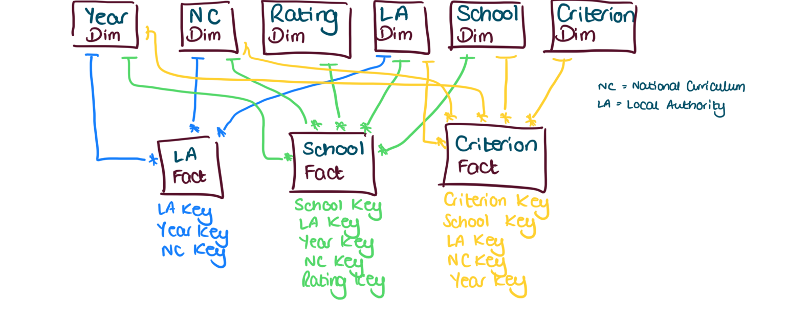

```{r setup, include=FALSE}
# Load knitr package
library(knitr)

# Knitr Options
opts_chunk$set(
	echo = TRUE,
	message = FALSE,
	warning = FALSE,
	fig.align = 'center'
)
```

# Introduction
This notebook reads the data in, defines the star-schema dimensional data model, and prepares the tables for the data model.

## Data sources
* https://www.gov.uk
* https://www.surreycc.gov.uk

## Packages
The following packages are required for this analysis:

* `tidyverse`
* `janitor`
```{r packages}
library(tidyverse)    # for general wrangling
library(janitor)      # for cleaning column headers
```

# Read data
## Offers by local authority
This dataset includes details of the number of offers made by preference within each local authority (LA) in England for the academic year 2014/15 through to 2021/2022. The data is aggregated by LA.

```{r read-offers-la}
# Read in the offers by LA data
r_offers_la <- 
  read_csv("data-in/offers-la/offers-by-la.csv") %>% 
  clean_names()
```

## Offers by school
This dataset includes admissions data for each school within Waverley Borough in Surrey for the academic year 2018/2019 through to 2021/2022. The data is aggregated by school.

```{r read-offers-school}
# Read in the offers by school data
# Step 1: create a list of files to read in
offers_sch_files <- 
  list.files(
    path = "data-in/offers-school",
    pattern = "*.csv",
    full.names = TRUE
  )

# Step 2: read all files into a list of df. Explicitly stating the 
# data type for each column to avoid binding issues later.
offers_sch_list <- 
  setNames(
    lapply(
      offers_sch_files,
      read_csv,
      col_types = "ncnncnnnn"
    ),
    offers_sch_files
  )

# Step 3: create a single df by binding rows from each df in the 
# list above
r_offers_sch <- offers_sch_list %>% 
  bind_rows(.id = "filename") %>% 
  clean_names()
```

## Offers by criteria
This dataset includes admissions data for each school within Waverley Borough in Surrey for the academic year 2018/2019 through to 2021/2022. The data is aggregated by school and by admission criterion.

```{r read-offers-crit}
# Read in the offers by criteria data
# Step 1: create a list of files to read in
offers_crit_files <- 
  list.files(
    path = "data-in/offers-criteria",
    pattern = "*.csv",
    full.names = TRUE
  )

# Step 2: read all files into a list of df. Explicitly stating the 
# data type for each column to avoid binding issues later.
offers_crit_list <- 
  setNames(
    lapply(
      offers_crit_files,
      read_csv,
      col_types = "ncnnccccnn"
    ),
    offers_crit_files
  )

# Step 3: create a single df by binding rows from each df in the list
# above
r_offers_crit <- offers_crit_list %>% 
  bind_rows(.id = "filename") %>% 
  clean_names()
```

## School information
This dataset includes characteristics of each school in Surrey (LA code 936) and Hampshire (LA code 850). The data is aggregated by school.

```{r read-info}
# Read in the info data
# Step 1: create a list of files to read in
info_files <- 
  list.files(
    path = "data-in/info",
    pattern = "*.csv",
    full.names = TRUE
  )

# Step 2: read all files into a list of df.
info_list <- 
  setNames(
    lapply(
      info_files,
      read_csv
    ),
    info_files
  )

# Step 3: create a single df by binding rows from each df in the list
# above
r_info <- info_list %>% 
  bind_rows(.id = "filename") %>% 
  clean_names()
```

## Key Stage 2 performance
This dataset includes details of primary school performance at Key Stage 2 (KS2). Also includes some school characteristics. The data is aggregated by school. KS2 is a phase of primary education for pupils aged 7 to 11 in England and Wales. A school's KS2 results therefore provide a measure of overall academic achievement.

```{r read-ks2}
# Read in Key Stage 2 data
# Step 1: create a list of files to read in
ks2_files <- 
  list.files(
    path = "data-in/ks2",
    pattern = "*.csv",
    full.names = TRUE
  )

# Step 2: read all files into a list of df. Reading all cols as
# character to avoid binding issues later
ks2_list <- 
  setNames(
    lapply(
      ks2_files,
      read_csv,
      col_types = cols(.default = "c")
    ),
    ks2_files
  )

# Step 3: create a single df by binding rows from each df in the list
# above
r_ks2 <- ks2_list %>% 
  bind_rows(.id = "filename")
```

## National curriculum years
This dataset includes details about the year groups that schools are divided into in the UK. The data is aggregated by year group.

```{r read-nc}
# Read in national curriculum data
# Step 1: create a list of files to read in
nc_files <- 
  list.files(
    path = "data-in/nc",
    pattern = "*.csv",
    full.names = TRUE
  )

# Step 2: read all files into a list of df.
nc_list <- 
  setNames(
    lapply(
      nc_files,
      read_csv
    ),
    nc_files
  )

# Step 3: create a single df by binding rows from each df in the list
# above
r_nc <- nc_list %>% 
  bind_rows(.id = "filename")
```

## Year
This dataset includes details about the academic years covered by the data.

```{r read-year}
# Read in year data
# Step 1: create a list of files to read in
year_files <- 
  list.files(
    path = "data-in/year",
    pattern = "*.csv",
    full.names = TRUE
  )

# Step 2: read all files into a list of df.
year_list <- 
  setNames(
    lapply(
      year_files,
      read_csv
    ),
    year_files
  )

# Step 3: create a single df by binding rows from each df in the list
# above
r_year <- year_list %>% 
  bind_rows(.id = "filename")
```

# Model data
Based on the data available, my intention is to build a star-schema data model that looks like this:


There are five dimension (lookup) tables and three fact (data) tables. The fact tables have the following grains:

* **Local Authority Facts**: one row represents one intake type (Reception, Year 3 or Year 7) for one local authority for one academic year.
* **School Facts**: one row represents one school for one academic year.
* **Criterion Facts**: one row represents one admissions criterion for one school for one academic year.

I created a file named [star-schema-planning.csv](ref/star-schema-planning.csv) which maps the raw source data to the corresponding dimension and fact tables for the star schema model.
```{r read-star-schema-planning}
# Read in star schema planning document
star_schema <- 
  read_csv("ref/star-schema-planning.csv") %>% 
  clean_names()
```

## Dimensions
### Criterion
The following columns are required for the criterion dimension table:
```{r cols-dim-criterion}
# Which columns are needed for the criterion dimension?
star_schema %>% 
  filter(model_table == "Criterion") %>% 
  kable(caption = "Columns required for the criterion dimension")
```

All of these columns come from the `r_offers_crit` dataframe. Let's first check the cleanliness of the data by ensuring that spelling variations are avoided for categorical data.

```{r uniques-criterion}
# View the unique values of criterion
r_offers_crit %>% 
  group_by(criterion) %>% 
  summarise(n = n()) %>% 
  kable(caption = "Unique values of the `criterion` column")
```

```{r uniques-criterion-category}
# View the unique values of criterion
r_offers_crit %>% 
  group_by(criterion_category) %>% 
  summarise(n = n()) %>% 
  kable(caption = "Unique values of the `criterion_category` column")
```

The columns all look ok. To build the dimension table, I can pull out the required columns from `r_offers_crit` and reduce to show only the unique values. I also want to add a new column called `enhanced_criterion_flag` which will determine whether the criterion is classed as enhanced or not. An enhanced criterion is any prioritised attribute other than distance from the school. Finally, I will need to add a unique identifier for each row to be used as the primary key.
```{r build-dim-criterion}
# Build out the criterion dimension table.
dim_criterion <- r_offers_crit %>% 
  # select only the required columns
  select(criterion,
         criterion_category,
         criterion_description) %>% 
  # remove duplicate values
  distinct() %>% 
  # add enhanced criterion flag
  mutate(enhanced_criterion_flag =
           if_else(criterion_category %in% c("Central & Lates",
                                             "Distance"),
                   "Not Enhanced",
                   "Enhanced")) %>% 
  # sort rows
  arrange(criterion_category,
          criterion,
          criterion_description) %>% 
  # add primary key
  mutate(criterion_key = row_number()) %>% 
  # sort columns
  select(criterion_key,
         criterion,
         criterion_category,
         enhanced_criterion_flag,
         criterion_description,
         everything())

# View the head of the new dimension table
dim_criterion %>% 
  head() %>% 
  kable(caption = "Head of the criterion dimension table")
```

### Local authority
The following columns are required for the local authority dimension table:
```{r cols-dim-la}
# Which columns are needed for the local authority dimension?
star_schema %>% 
  filter(model_table == "Local Authority") %>% 
  kable(caption = "Columns required for the local authority dimension")
```

All of these columns we need come from the `r_offers_la` dataframe. Even though there are some columns showing from other source data tables, those are simply duplicates of the LA Code field. Let's first check the cleanliness of the data by ensuring that spelling variations are avoided for categorical data.
```{r uniques-country-name}
# View the unique values of country
r_offers_la %>% 
  group_by(country_code,
           country_name) %>% 
  summarise(n = n()) %>% 
  kable(caption = "Unique values of the `country_code` and `country_name` columns")
```

```{r uniques-region-name}
# View the unique values of region
r_offers_la %>% 
  group_by(region_code,
           region_name) %>% 
  summarise(n = n()) %>% 
  kable(caption = "Unique values of the `region_code` and `region_name` columns")
```

To build the dimension table, I can pull out the required columns from `r_offers_la` and reduce to show only the unique values. Finally, I will need to add a unique identifier for each row to be used as the primary key.

```{r build-dim-la}
# Build out the local authority dimension table.
dim_la <- r_offers_la %>% 
  # select/rename only the required columns
  select(country_code,
         country = country_name,
         region_code,
         region = region_name,
         old_la_code,
         new_la_code,
         local_authority = la_name) %>% 
  # remove duplicate values
  distinct() %>%
  # sort rows
  arrange(country_code,
          region_code,
          new_la_code) %>% 
  # add primary key
  mutate(la_key = row_number()) %>% 
  # sort columns
  select(la_key,
         everything())

# View the head of the new dimension table
dim_la %>% 
  head() %>% 
  kable(caption = "Head of the local authority dimension table")
```

### School
The following columns are required for the school dimension table:
```{r cols-dim-school}
# Which columns are needed for the school dimension?
star_schema %>% 
  filter(model_table == "School") %>% 
  kable(caption = "Columns required for the school dimension")
```

The columns we need for this dimension come from the `r_info` dataframe. Let's first check the cleanliness of the data by ensuring that spelling variations are avoided for categorical data.

```{r uniques-school-type}
# View the unique values of school type
r_info %>% 
  group_by(establishment_type_group_name) %>% 
  summarise(n = n()) %>% 
  kable(caption = "Unique values of the `establishment_type_group_name` column")
```

These values look ok.
```{r uniques-school-religion}
# View the unique values of religious character
r_info %>% 
  group_by(religious_character_name) %>% 
  summarise(n = n()) %>% 
  kable(caption = "Unique values of the `religious_character_name` column")
```

Some recoding is necessary here. In our clean dimension table we will need to recode `None` as `Does not apply` and `Church of England/Methodist` as `Church of England`.

```{r uniques-school-rating}
# View the unique values of Ofsted rating
r_info %>% 
  group_by(ofsted_rating_name) %>% 
  summarise(n = n()) %>% 
  kable(caption = "Unique values of the `ofsted_rating_name` column")
```

Some recoding is necessary here. According to [Ofsted](https://www.gov.uk/government/publications/education-inspection-framework/education-inspection-framework), school inspections use a 4-point grading scale:

* grade 1 - outstanding
* grade 2 - good
* grade 3 - requires improvement
* grade 4 - inadequate

In our dataset, we see a value of `Serious Weaknesses`, which is not on the ratings list provided by Ofsted. In fact, the rating of "Serious Weaknesses" is a [subset](https://schools.oxfordshire.gov.uk/cms/sites/schools/files/folders/folders/documents/ofsted/Monitoring%20inspections%20of%20schools%20that%20have%20serious%20weaknesses.doc) of the "inadequate" (grade 4) rating. Therefore, we can recode `Serious Weaknesses` as `inadequate`. We can also add in the grade points to the ratings dimension table to provide a quantitative and aggregatable measure.

##### A note on the URN and DfE number
The URN and DfE numbers are both reference numbers which denote both the school name and the school type. So if a school converts from a maintained school to an academy it receives a new URN and sometimes a new DfE number. The `r_info` dataframe includes a column called `linked_establishments` which can help us to link together schools which have had a change of URN. We will need to create a bridging table to denote which schools are associated with which URNs and DfE numbers.

To build the dimension table, I can pull out the required columns from `r_info` and reduce to show only the unique values. I will make the adjustments noted above and finally, I will need to add a unique identifier for each row to be used as the primary key.

```{r build-dim-school}
# Build out the school dimension table
dim_school_prep <- r_info %>%
  # split the linked_establishments column into useful data
  mutate(
    linked_urn = as.numeric(
      str_extract(
        linked_establishments,
        "\\d+"
      )
    ),
    linked_urn_description = str_trim(
      str_extract(
        linked_establishments,
        "\\D+"
      )
    )
  ) %>% 
  # add the dfe_number
  mutate(dfe_number = paste0(
    la_code,
    "/",
    establishment_number
  )) %>% 
  # select/rename the required columns
  select(urn,
         linked_urn,
         establishment_number,
         dfe_number,
         school_name = establishment_name,
         school_type = establishment_type_group_name,
         school_status = establishment_status_name,
         religious_character = religious_character_name,
         statutory_low_age,
         statutory_high_age,
         percentage_fsm,
         administrative_district = district_administrative_name,
         school_capacity,
         census_date,
         number_of_pupils,
         number_of_boys,
         number_of_girls,
         number_of_fsm = fsm,
         ofsted_rating_name,
         ofsted_last_insp,
         street,
         locality,
         address3,
         town,
         county = county_name,
         postcode,
         school_website,
         telephone_num,
         head_title = head_title_name,
         head_first_name,
         head_last_name,
         head_preferred_job_title,
         linked_establishments,
         linked_urn_description) %>%
  # remove duplicates
  distinct() %>% 
  # recode religion
  mutate(religious_character = case_when(
    grepl("Methodist", religious_character) ~ "Church of England",
    grepl("None", religious_character) ~ "Does not Apply",
    TRUE ~ religious_character
  )) %>% 
  # recode ofsted rating
  mutate(ofsted_rating_name = case_when(
    grepl("Weakness", ofsted_rating_name) ~ "Inadequate",
    is.na(ofsted_rating_name) ~ "Not reported",
    TRUE ~ ofsted_rating_name
  )) %>% 
  # add rating score
  mutate(ofsted_rating_score = case_when(
    grepl("Outstanding", ofsted_rating_name) ~ 1,
    grepl("Good", ofsted_rating_name) ~ 2,
    grepl("improvement", ofsted_rating_name) ~ 3,
    grepl("Inadequate", ofsted_rating_name) ~ 4
  ))

# Build a table for the linked establishment numbers and DfE numbers
dim_school_links <- 
  dim_school_prep %>% 
  # keep only the records that have links
  filter(
    !is.na(linked_urn)
  ) %>% 
  # select required columns
  select(
    urn = linked_urn,
    linked_establishment_number = establishment_number,
    linked_dfe_number = dfe_number
  )
  
# Join the tables
dim_school_joined <-
  dim_school_prep %>% 
  left_join(
    dim_school_links
  ) %>% 
  # sort rows
  arrange(dfe_number,
          urn) %>% 
  # add primary key
  mutate(school_key = row_number())

# Build the bridging table
bridge_school_urn_prep <- 
  dim_school_joined %>% 
  # select the required columns
  select(
    school_key,
    urn,
    linked_urn,
    establishment_number,
    linked_establishment_number,
    dfe_number,
    linked_dfe_number,
    linked_urn_description
  ) %>% 
  # pivot the urns
  pivot_longer(
    cols = ends_with("urn"),
    names_to = "urn_type",
    values_to = "urn",
    values_drop_na = TRUE
  ) %>% 
  # recode urn_type
  mutate(
    urn_type = case_when(
      urn_type == "urn" ~ "Current",
      urn_type == "linked_urn" ~ "Linked"
    )
  ) %>% 
  # pivot the establishment numbers
  pivot_longer(
    cols = ends_with("establishment_number"),
    names_to = "en_type",
    values_to = "establishment_number",
    values_drop_na = TRUE
  ) %>% 
  # recode en_type
  mutate(
    en_type = case_when(
      en_type == "establishment_number" ~ "Current",
      en_type == "linked_establishment_number" ~ "Linked"
    )
  ) %>% 
  # pivot the dfe numbers
  pivot_longer(
    cols = ends_with("dfe_number"),
    names_to = "dfe_no_type",
    values_to = "dfe_number",
    values_drop_na = TRUE
  ) %>% 
  # recode en_type
  mutate(
    dfe_no_type = case_when(
      dfe_no_type == "dfe_number" ~ "Current",
      dfe_no_type == "linked_dfe_number" ~ "Linked"
    )
  ) %>% 
  # reorder the columns
  select(
    school_key,
    urn,
    urn_type,
    establishment_number,
    en_type,
    dfe_number,
    dfe_no_type,
    everything()
  ) %>% 
  # remove duplicates
  distinct()

# Tidy the school dimension table
dim_school <- 
  dim_school_joined %>% 
  # filter to keep only open and orphan closed schools
  filter(
    (school_status == "Closed"
      & is.na(linked_urn)) |
    school_status == "Open"
  ) %>% 
  # remove the link columns
  select(
    !(starts_with("linked_"))
  ) %>% 
  # remove duplicates
  distinct(
    across(
      -school_key
    ),
    .keep_all = TRUE
  )

# Tidy the bridging table
bridge_school_urn <- 
  bridge_school_urn_prep %>% 
  # keep only the school keys that are present in school dimension
  filter(
    school_key %in% dim_school$school_key
  )

# View the head of the new dimension table
dim_school %>% 
  select(1:5) %>% 
  head() %>% 
  kable(caption = "Head of the school dimension table (columns truncated)")
```

### National curriculum year
This dimension contains columns relating to the national curriculum years associated with school, and can be used to allow us to distinguish between primary and secondary facts at the local authority level. For this one, we need to include everything in the `r_nc` dataframe with the exception of the filename.

```{r build-dim-nc}
# Build out the nc dimension table
dim_nc <- r_nc %>% 
  #remove the filename column
  select(-filename)

# View the head of the new dimension table
dim_nc %>% 
  select(1:5) %>% 
  head() %>% 
  kable(caption = "Head of the national curriculum year dimension table")
```

### Year
This dimension will function as our date table. The dates in this case are all at the year level. We can use this dimension to structure the academic year identifiers in different ways and to segment the years by major events (e.g. the COVID-19 pandemic). For this one, we need to include everything in the `r_year` dataframe with the exception of the filename.

```{r build-dim-year}
# Build out the year dimension table
dim_year <- r_year %>% 
  #remove the filename column
  select(-filename)

# View the head of the new dimension table
dim_year %>% 
  select(1:5) %>% 
  head() %>% 
  kable(caption = "Head of the year dimension table")
```

## Facts
### Local authority
The following columns are required for the local authority fact table:
```{r cols-fact-la}
# Which columns are required for the LA fact table?
star_schema %>% 
  filter(model_table == "Local Authority Facts") %>% 
  kable(caption = "Columns required for the local authority fact")
```

All of these columns come from the `r_offers_la` dataframe. In addition we need the following keys to join this fact table to our dimensions:

* LA Key
* Year Key
* NC Key

We will further need to filter the `r_offers_la` dataframe to include only rows that are aggregated at the local authority level.

```{r build-fact-la}
# Build out the local authority fact table
fact_la <- r_offers_la %>% 
  # filter to local authority level only
  filter(geographic_level == "Local authority") %>% 
  # join the LA Key
  left_join(select(dim_la,
                   la_key,
                   old_la_code)) %>% 
  # create year key on the fact side
  mutate(year_key = str_sub(time_period,1,4)) %>% 
  # join the nc year key
  rename(nc_year = nc_year_admission) %>% 
  left_join(select(dim_nc,
                   nc_key,
                   nc_year)) %>% 
  # select/rename the columns required
  select(la_key,
         year_key,
         nc_key,
         admission_numbers,
         applications_received,
         online_applications,
         no_of_preferences,
         first_preference_offers,
         second_preference_offers,
         third_preference_offers,
         preferred_school_offer,
         non_preferred_offer,
         no_offer,
         schools_in_la_offer,
         schools_in_another_la_offer)

# View the head of the new fact table
fact_la %>% 
  select(1:5) %>% 
  head() %>% 
  kable(caption = "Head of the local authority fact table")
```

### School
The following columns are required for the school fact table:
```{r cols-fact-school}
# Which columns are required for the school fact table?
star_schema %>% 
  filter(model_table == "School Facts") %>% 
  kable(caption = "Columns required for the school fact")
``` 

All of these columns come from the `r_ks2` and `r_offers_sch` dataframes. In addition we need the following keys to join this fact table to our dimensions:

* School Key
* LA Key
* Year Key

We will further need to filter the `r_ks2` dataframe to include only rows that are aggregated at the mainstream school level (`RECTYPE = 1`).

```{r build-fact-school}
# Build out the school fact table
# Step 1: Build out the school offers facts
fact_school_offers <- r_offers_sch %>% 
  # rename year key
  rename(year_key = intake_year) %>% 
  # join the LA Key
  left_join(select(dim_la,
                   la_key,
                   la_code = old_la_code)) %>% 
  # join the School Key
  left_join(select(bridge_school_urn,
                   school_key,
                   dfe_no = dfe_number)) %>% 
  # remove duplicates
  distinct() %>% 
  # select/rename the columns required
  select(year_key,
         la_key,
         school_key,
         adm_pan = pan,
         adm_preferences = total_preferences,
         adm_offered = total_offered,
         adm_last_distance = last_distance_offered)

# Step 2: Build out the school KS2 facts
fact_school_ks2 <- r_ks2 %>% 
  # filter to mainstream school level only
  filter(RECTYPE == 1) %>% 
  # join the LA Key
  mutate(LEA = as.numeric(LEA)) %>% 
  left_join(select(dim_la,
                   la_key,
                   LEA = old_la_code)) %>% 
  # add the dfe_number
  mutate(dfe_number = paste0(
    LEA,
    "/",
    ESTAB
  )) %>% 
  # join the school key
  mutate(URN = as.numeric(URN)) %>% 
  left_join(select(dim_school,
                   school_key,
                   URN = urn)) %>% 
  # create year key on the fact side
  mutate(year_key = as.numeric(str_sub(filename,13,16))) %>%
  # select/rename the columns required
  select(la_key,
         year_key,
         school_key,
         ks2_pupils = TELIG,
         ks2_boys = BELIG,
         ks2_girls = GELIG,
         ks2_disadvantaged_pupils = TFSM6CLA1A,
         ks2_english_additional_language_pupils = TEALGRP2,
         ks2_non_mobile_pupils = TMOBN,
         ks2_sen_pupils = TSENELEK,
         ks1_avg_score = TKS1AVERAGE,
         ks1_pupils_low_attainment = TKS1GROUP_L,
         ks1_pupils_med_attainment = TKS1GROUP_M,
         ks1_pupils_high_attainment = TKS1GROUP_H,
         ks1_pupils_na_attainment = TKS1GROUP_NA,
         ks2_reading_progress = READPROG,
         ks2_writing_progress = WRITPROG,
         ks2_maths_progress = MATPROG,
         ks2_reading_progress_boys = READPROG_B,
         ks2_writing_progress_boys = WRITPROG_B,
         ks2_maths_progress_boys = MATPROG_B,
         ks2_reading_progress_girls = READPROG_G,
         ks2_writing_progress_girls = WRITPROG_G,
         ks2_maths_progress_girls = MATPROG_G)

# Step 3: Join the tables together
fact_school <- fact_school_offers %>% 
  full_join(fact_school_ks2) %>% 
  arrange(year_key,
          la_key,
          school_key)

# View the head of the new fact table
fact_school %>% 
  select(1:5) %>% 
  head() %>% 
  kable(caption = "Head of the school fact table")
```

### Criterion
The following columns are required for the school fact table:
```{r cols-fact-crit}
# Which columns are required for the criterion fact table?
star_schema %>% 
  filter(model_table == "Criterion Facts") %>% 
  kable(caption = "Columns required for the criterion fact")
``` 

All of these columns come from the `r_offers_crit` dataframe. In addition we need the following keys to join this fact table to our dimensions:

* Criterion Key
* School Key
* LA Key
* Year Key

```{r build-fact-crit}
# Build out the criterion fact table
# Step 1: Build out the school offers facts
fact_criterion <- r_offers_crit %>% 
  # rename year key
  rename(year_key = intake_year) %>% 
  # join the LA Key
  left_join(select(dim_la,
                   la_key,
                   la_code = old_la_code)) %>% 
  # join the School Key
  left_join(select(dim_school,
                   school_key,
                   dfe_no = dfe_number,
                   school_status)) %>% 
  # filter to keep only one record for each dfe_no/year
  group_by(year_key,
           dfe_no) %>% 
  slice_max(school_status) %>% 
  ungroup() %>% 
  # join the Criterion Key
  left_join(dim_criterion) %>% 
  # select/rename the columns required
  select(year_key,
         la_key,
         school_key,
         criterion_key,
         criterion_priority = priority,
         criterion_offers)

# View the head of the new fact table
fact_criterion %>% 
  select(1:5) %>% 
  head() %>% 
  kable(caption = "Head of the criterion fact table")
```

# Export data
The final dimension and fact tables can now be exported as both CSV files and RDA files.
```{r export-data}
# Export all dimension and fact tables as CSV
# Criterion dimension
write_csv(
  dim_criterion,
  "data-out/dim_criterion.csv",
  na = ""
)

# Local authority dimension
write_csv(
  dim_la,
  "data-out/dim_la.csv",
  na = ""
)

# National curriculum dimension
write_csv(
  dim_nc,
  "data-out/dim_nc.csv",
  na = ""
)

# School dimension
write_csv(
  dim_school,
  "data-out/dim_school.csv",
  na = ""
)

# Year dimension
write_csv(
  dim_year,
  "data-out/dim_year.csv",
  na = ""
)

# Criterion fact
write_csv(
  fact_criterion,
  "data-out/fact_criterion.csv",
  na = ""
)

# Local authority fact
write_csv(
  fact_la,
  "data-out/fact_la.csv",
  na = ""
)

# School fact
write_csv(
  fact_school,
  "data-out/fact_school.csv",
  na = ""
)

# Save all dimension and fact tables as RDA
# Criterion dimension
save(
  dim_criterion,
  file = "rda/dim_criterion.rda"
)

# Local authority dimension
save(
  dim_la,
  file = "rda/dim_la.rda"
)

# National curriculum dimension
save(
  dim_nc,
  file = "rda/dim_nc.rda"
)

# School dimension
save(
  dim_school,
  file = "rda/dim_school.rda"
)

# Year dimension
save(
  dim_criterion,
  file = "rda/dim_year.rda"
)

# Criterion fact
save(
  fact_criterion,
  file = "rda/fact_criterion.rda"
)

# Local authority fact
save(
  fact_la,
  file = "rda/fact_la.rda"
)

# School fact
save(
  fact_school,
  file = "rda/fact_school.rda"
)
```

